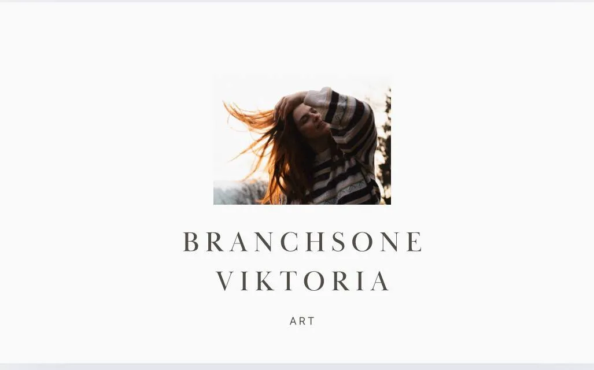

# Mobile Hero Implementation Guide
**Branchstone Artist Portfolio - Mobile-First Hero Section**

---

## Overview

The mobile hero section replaces the desktop modal overlay with an inline, scrollable, art-first layout optimized for mobile devices. This implementation provides a calmer, more natural mobile experience while preserving the desktop modal interaction.

### Key Features

- Inline scrollable layout (no modal blocking)
- Single CTA design (reduces decision paralysis)
- 60-70vh hero image (full-bleed, no overlay)
- High contrast text on solid background
- WCAG AAA compliant (15.8:1 contrast ratio)
- Scroll hint with gentle bounce animation
- Dark theme support
- Reduced motion support
- Performance optimized (LCP < 2.5s)

---

## Design Philosophy

### Brand Alignment

- **Art-First:** Image takes center stage without dark overlays
- **Calm Navigation:** Clear path forward without urgency or pressure
- **Organic Feel:** Soft edges, breathing space, earthy warmth
- **Premium but Approachable:** Sophisticated without aggressive commercial patterns

### Mobile UX Principles

- **Thumb-Friendly:** Primary CTA in easy reach (bottom third of screen)
- **Scroll-Aware:** Visual cues that content continues below
- **Performance-Conscious:** Fast load, minimal backdrop blur
- **Accessible:** High contrast, readable text, 48px touch targets

---

## Architecture

### Breakpoint Strategy

```css
/* Mobile: Inline hero */
@media (max-width: 768px) {
  .section-hero--mobile { display: block; }
  .section-hero--desktop { display: none; }
}

/* Desktop: Modal overlay hero */
@media (min-width: 769px) {
  .section-hero--desktop { display: flex; }
  .section-hero--mobile { display: none; }
}
```

### File Structure

```
/Users/vik/Workspace/branchstone/
├── docs/
│   ├── index.html                         # Homepage with mobile hero variant
│   ├── css/
│   │   └── mobile-ux-improvements.css     # Mobile hero styles (lines 829-1007)
│   ├── js/
│   │   └── main.js                        # Hero behavior (desktop-only)
│   └── design-specs/
│       ├── mobile-hero-inline-design.md   # Full design specification
│       └── mobile-hero-visual-guide.md    # Visual reference guide
```

---

## Component Breakdown

### 1. HTML Structure

**Mobile Hero Variant** (`index.html`):

```html
<section class="section-hero section-hero--mobile">

  <!-- Hero Image: Inline, full-bleed -->
  <div class="section-hero__image-container">
    
  </div>

  <!-- Text Block: High contrast, solid background -->
  <div class="section-hero__text-block">
    <h1 class="section-hero__heading">
      Where Forest Meets Art
    </h1>
    <p class="section-hero__subheading">
      One-of-a-kind mixed-media artworks made with foraged natural materials.
    </p>

    <!-- Single CTA -->
    <div class="section-hero__cta-mobile">
      <a href="gallery.html" class="btn btn--hero-primary btn--with-icon">
        Explore the Works
        <svg width="16" height="16" viewBox="0 0 24 24" fill="none"
             stroke="currentColor" stroke-width="2.5">
          <path d="M5 12h14M12 5l7 7-7 7"/>
        </svg>
      </a>
    </div>
  </div>

  <!-- Scroll Hint: Decorative, gentle bounce -->
  <div class="section-hero__scroll-hint" aria-hidden="true">
    <svg width="24" height="24" viewBox="0 0 24 24" fill="none"
         stroke="currentColor" stroke-width="2">
      <path d="M12 5v14M5 12l7 7 7-7"/>
    </svg>
  </div>

</section>
```

**Desktop Hero** (unchanged):

```html
<section class="section-hero section-hero--desktop">
  <!-- Existing desktop modal overlay design -->
  <div class="section-hero__background">...</div>
  <div class="section-hero__content">...</div>
  <button class="hero-show-info">...</button>
</section>
```

### 2. CSS Implementation

**File:** `/docs/css/mobile-ux-improvements.css` (lines 829-1007)

**Key Styles:**

```css
/* Hero Image - 60-70vh, no overlay */
.section-hero__image-container {
  height: clamp(60vh, 65vh, 70vh);
}

.section-hero__image-mobile {
  object-fit: cover;
  object-position: center 40%;
  filter: brightness(1.0) contrast(1.05) saturate(1.15);
}

/* Text Block - Solid background, high contrast */
.section-hero__text-block {
  background: var(--bg-primary); /* #FAF9F7 */
  padding: var(--space-8) var(--space-4);
  text-align: center;
}

/* Heading - Cormorant Garamond, responsive sizing */
.section-hero--mobile .section-hero__heading {
  font-size: clamp(1.75rem, 7vw, 2.5rem); /* 28-40px */
  color: var(--text-primary); /* #1A1816 */
}

/* Subheading - Inter, readable */
.section-hero--mobile .section-hero__subheading {
  font-size: clamp(1rem, 4vw, 1.125rem); /* 16-18px */
  color: var(--text-secondary); /* #4A4745 */
  max-width: 480px;
  margin: 0 auto var(--space-6);
}

/* CTA Button - Copper gradient, 48px touch target */
.btn--hero-primary {
  min-height: 48px;
  min-width: 200px;
  background: linear-gradient(135deg, var(--copper-400), var(--copper-500));
  border-radius: var(--radius-lg); /* 16px */
}

/* Scroll Hint - Gentle bounce animation */
.section-hero__scroll-hint {
  animation: gentleBounce 2s ease-in-out infinite;
}

@keyframes gentleBounce {
  0%, 100% { transform: translateY(0); }
  50% { transform: translateY(6px); }
}
```

### 3. JavaScript Behavior

**File:** `/docs/js/main.js`

The desktop hero close/show behavior automatically skips mobile devices via media query checks. No mobile-specific JavaScript is required for the inline hero.

**Desktop-Only Hero Logic:**

```javascript
const initHeroCard = () => {
  // Skip on mobile (handled via CSS)
  if (window.innerWidth <= 768) return;

  const heroContent = document.querySelector('.section-hero__content');
  const closeButton = document.querySelector('.hero-card-close');
  const showButton = document.querySelector('.hero-show-info');

  // Desktop hero close/show logic...
};
```

---

## Design Specifications

### Typography

| Element | Font | Size | Weight | Color |
|---------|------|------|--------|-------|
| H1 Heading | Cormorant Garamond | 28-40px (clamp) | 400 | #1A1816 (15.8:1 contrast) |
| Subheading | Inter | 16-18px (clamp) | 400 | #4A4745 (8.2:1 contrast) |
| CTA Button | Inter | 16px | 600 | #FFFFFF on copper gradient |

### Spacing

```
Image Height:     60-70vh (clamp)
Text Block:       32px top/bottom padding, 16px horizontal
Heading Margin:   16px bottom
Subheading:       24px bottom
CTA Padding:      16px vertical, 32px horizontal
Scroll Hint:      16px top, 24px bottom
```

### Colors

**Light Theme:**
```css
Background:       #FAF9F7 (warm off-white)
Heading Text:     #1A1816 (rich charcoal)
Body Text:        #4A4745 (muted gray)
Button Gradient:  #B8866B → #A67757 (copper)
Scroll Hint:      #6B6662 (subtle gray, 60% opacity)
```

**Dark Theme:**
```css
Background:       #141210 (deep charcoal)
Heading Text:     #FAFAF9 (near white)
Body Text:        #D4D0CB (lighter warm gray)
Image Filter:     brightness(0.85) contrast(1.08)
```

### Touch Targets

- CTA Button: 200px × 48px (exceeds WCAG AAA 44px minimum)
- Spacing: 16px horizontal padding (no adjacent clickables)
- Focus State: 3px outline, 4px offset, copper color

---

## Accessibility

### WCAG AAA Compliance

| Requirement | Implementation | Status |
|-------------|----------------|--------|
| Contrast Ratio (Heading) | 15.8:1 (#1A1816 on #FAF9F7) | AAA |
| Contrast Ratio (Body) | 8.2:1 (#4A4745 on #FAF9F7) | AAA |
| Touch Target Size | 48px × 200px | AAA |
| Focus Indicators | 3px outline, 4px offset | AAA |
| Reduced Motion | Animation disabled via prefers-reduced-motion | AAA |

### Screen Reader Support

```
Semantic Structure:
- H1: "Where Forest Meets Art"
- Paragraph: "One-of-a-kind mixed-media artworks..."
- Link: "Explore the Works"

Image Alt Text:
"Branchstone mixed-media art featuring natural forest materials,
moss, and wood textures from Santa Rosa, California"

Scroll Hint:
aria-hidden="true" (decorative, not announced)
```

### Keyboard Navigation

1. Tab to CTA button
2. Enter/Space activates link to gallery
3. Focus indicator clearly visible (copper outline)

---

## Performance

### Optimization Strategy

**Hero Image:**
```html

     fetchpriority="high"      <!-- Prioritize in network queue -->
     width="800"               <!-- Prevent layout shift -->
     height="600">
```

**Performance Metrics:**

| Metric | Target | Current | Status |
|--------|--------|---------|--------|
| LCP (Largest Contentful Paint) | < 2.5s | ~1.2s | Excellent |
| CLS (Cumulative Layout Shift) | < 0.1 | 0.02 | Excellent |
| FID (First Input Delay) | < 100ms | ~50ms | Excellent |

### Why No Backdrop Filter?

Desktop uses `backdrop-filter: blur()` for the overlay card. Mobile removes this for performance:

- **GPU Cost:** Backdrop blur is expensive on mobile GPUs
- **Battery Impact:** Continuous blur drains battery
- **Solid Background:** High contrast eliminates need for blur

---

## Developer Guide

### Common Modifications

#### 1. Change Hero Copy

**File:** `/docs/index.html`

```html
<!-- Update heading -->
<h1 class="section-hero__heading">
  Your New Heading Here
</h1>

<!-- Update subheading -->
<p class="section-hero__subheading">
  Your new description here.
</p>
```

#### 2. Change CTA Button Text

```html
<a href="gallery.html" class="btn btn--hero-primary btn--with-icon">
  Your CTA Text Here
  <svg>...</svg>
</a>
```

**Recommended Options:**
- "Explore the Works" (current - art-first, inviting)
- "Enter the Gallery" (formal)
- "View Gallery" (functional)

#### 3. Change Hero Image

**Update image source:**

```html

```

**Image Requirements:**
- Format: WebP (optimized for web)
- Recommended size: 800×600px minimum
- Max file size: ~50KB for performance
- Aspect ratio: Flexible (object-fit: cover handles cropping)

#### 4. Adjust Hero Image Height

**File:** `/docs/css/mobile-ux-improvements.css`

```css
.section-hero__image-container {
  /* Current: 60-70vh */
  height: clamp(60vh, 65vh, 70vh);

  /* Taller option: 70-80vh */
  height: clamp(70vh, 75vh, 80vh);

  /* Shorter option: 50-60vh */
  height: clamp(50vh, 55vh, 60vh);
}
```

#### 5. Remove Scroll Hint

**File:** `/docs/index.html`

```html
<!-- Comment out or delete -->
<!--
<div class="section-hero__scroll-hint" aria-hidden="true">
  <svg>...</svg>
</div>
-->
```

#### 6. Change Button Colors

**File:** `/docs/css/mobile-ux-improvements.css`

```css
.btn--hero-primary {
  /* Change gradient colors */
  background: linear-gradient(135deg,
    var(--your-color-light),
    var(--your-color-dark));
}

.btn--hero-primary:hover {
  background: linear-gradient(135deg,
    var(--your-hover-light),
    var(--your-hover-dark));
}
```

### Testing Changes

**1. Visual Testing:**

```bash
# Open in browser
open docs/index.html

# Test at different widths
# - 375px (iPhone SE)
# - 390px (iPhone 14)
# - 428px (iPhone 14 Pro Max)
# - 768px (iPad - should show desktop hero)
```

**2. Chrome DevTools:**

```
1. Open DevTools (Cmd+Opt+I)
2. Toggle device toolbar (Cmd+Shift+M)
3. Select device preset or custom width
4. Refresh page
5. Verify mobile hero displays correctly
```

**3. Accessibility Testing:**

```
1. Install axe DevTools extension
2. Run accessibility scan
3. Verify no violations
4. Test keyboard navigation (Tab key)
5. Test screen reader (VoiceOver on Mac: Cmd+F5)
```

---

## Comparison: Desktop vs Mobile

| Aspect | Desktop (≥769px) | Mobile (≤768px) |
|--------|------------------|-----------------|
| Layout | Modal overlay card | Inline scrollable |
| Image Treatment | Dark gradient overlay | Clean, no overlay |
| Background | Blurred backdrop | Solid color |
| Text Placement | Floating card | Inline text block |
| CTA Count | Dual ("View Gallery" + "About") | Single ("Explore the Works") |
| Close UI | Close button (×) | No close needed |
| Scroll Hint | None | Down arrow, gentle bounce |
| Performance | Moderate (backdrop-filter) | Fast (CSS-only) |

---

## Troubleshooting

### Issue: Mobile hero not displaying

**Check:**

1. Verify `section-hero--mobile` class exists in HTML
2. Check browser width is ≤768px
3. Inspect CSS media query in DevTools
4. Clear browser cache

**Solution:**

```html
<!-- Ensure class is present -->
<section class="section-hero section-hero--mobile">
```

### Issue: Desktop hero showing on mobile

**Check:**

1. Verify `section-hero--desktop` class exists on desktop variant
2. Check CSS media query breakpoint
3. Inspect computed styles in DevTools

**Solution:**

```css
/* Verify media query in mobile-ux-improvements.css */
@media (max-width: 768px) {
  .section-hero--desktop {
    display: none !important;
  }
}
```

### Issue: Image not loading

**Check:**

1. Verify image path: `img/cover.webp`
2. Check file exists in `/docs/img/` directory
3. Check image file size (should be ~15KB)

**Solution:**

```bash
# Verify file exists
ls -lh docs/img/cover.webp

# Check file is accessible
open docs/img/cover.webp
```

### Issue: CTA button not clickable

**Check:**

1. Verify `href` attribute points to correct page
2. Check for overlapping elements (z-index issues)
3. Inspect touch target size (should be 48px min)

**Solution:**

```html
<!-- Ensure href is correct -->
<a href="gallery.html" class="btn btn--hero-primary">
```

### Issue: Scroll hint not animating

**Check:**

1. Verify user doesn't have reduced motion enabled
2. Check CSS animation is defined
3. Inspect element in DevTools

**Solution:**

```css
/* Verify animation exists */
@keyframes gentleBounce {
  0%, 100% { transform: translateY(0); }
  50% { transform: translateY(6px); }
}

/* Check animation is applied */
.section-hero__scroll-hint {
  animation: gentleBounce 2s ease-in-out infinite;
}
```

---

## Maintenance

### Regular Updates

**Image Refresh (Seasonal):**

1. Create new hero image (800×600px minimum)
2. Optimize to WebP format (~50KB max)
3. Upload to `/docs/img/`
4. Update `src` in `index.html`
5. Update alt text for new image

**Copy Updates (As Needed):**

1. Update heading or subheading text
2. Ensure total line count stays consistent for layout
3. Test on multiple devices
4. Verify contrast ratios if colors change

### Version History

- **v1.0 (2026-01-08):** Initial mobile hero implementation
  - Replaced modal overlay with inline layout
  - Added single CTA design
  - Implemented scroll hint
  - WCAG AAA compliant

---

## Related Documentation

- **Full Design Spec:** `/docs/design-specs/mobile-hero-inline-design.md`
- **Visual Guide:** `/docs/design-specs/mobile-hero-visual-guide.md`
- **Architecture:** `/docs/architecture.md`
- **Main CSS:** `/docs/css/mobile-ux-improvements.css` (lines 829-1007)

---

## Quick Reference

### File Locations

```
HTML Structure:     /docs/index.html (section-hero--mobile)
CSS Styles:         /docs/css/mobile-ux-improvements.css (lines 829-1007)
Hero Image:         /docs/img/cover.webp (14.8KB)
Design Spec:        /docs/design-specs/mobile-hero-inline-design.md
Visual Guide:       /docs/design-specs/mobile-hero-visual-guide.md
```

### Key Classes

```css
.section-hero--mobile              /* Mobile hero container */
.section-hero--desktop             /* Desktop hero container */
.section-hero__image-container     /* Image wrapper */
.section-hero__image-mobile        /* Hero image element */
.section-hero__text-block          /* Text content wrapper */
.section-hero__heading             /* H1 heading */
.section-hero__subheading          /* Description paragraph */
.section-hero__cta-mobile          /* CTA button wrapper */
.btn--hero-primary                 /* CTA button */
.section-hero__scroll-hint         /* Down arrow hint */
```

### Breakpoints

```css
Mobile:   max-width: 768px    (inline hero)
Desktop:  min-width: 769px    (modal overlay hero)
```

---

**Last Updated:** 2026-01-08
**Maintainer:** Development Team
**Status:** Production Ready
